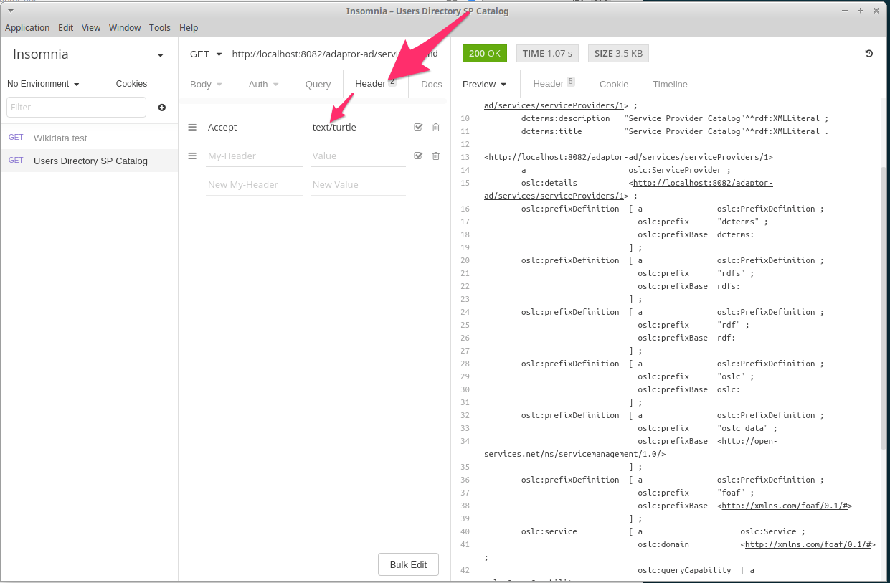
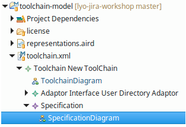
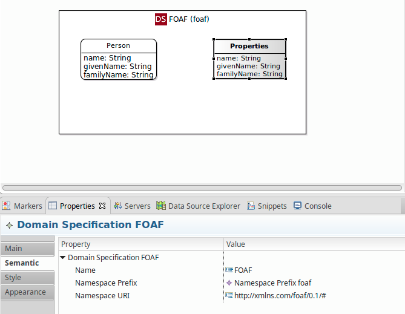
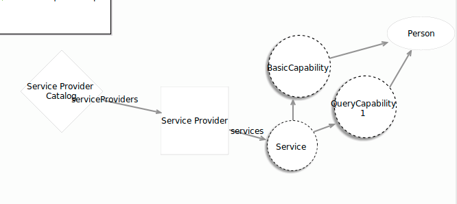
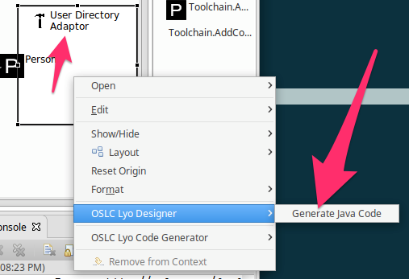
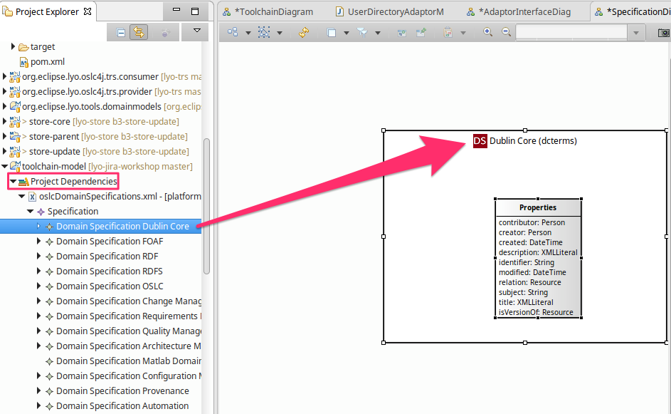
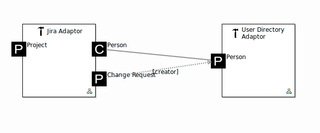
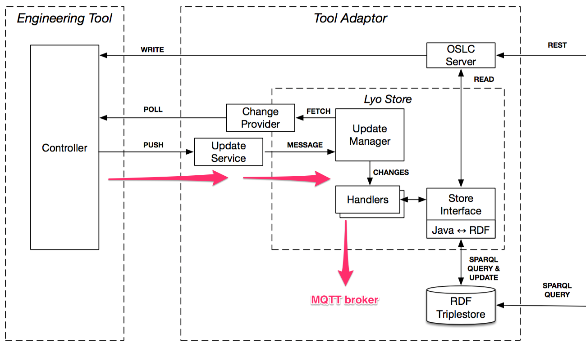

# Introduction

### Format

- 1-hour lecture
- 2-hour hands-on
- **Make sure you have the OVA virtual machine image imported into VirtualBox and verify that the VM boots and Eclipse link on the desktop works!**

> **These slides are already in the VM under `lyo-workshop/lyo-jira-workshop/docs/`**

# OSLC & Linked Data intro lecture

<!-- Other slides are used here -->

# Hands-on

## Preliminaries

### Task recap

- Users Directory linked data service (adaptor)
- Jira adaptor
- Connect Jira bug authors to UD users
- Stream the adaptor resource updates over TRS (MQTT)
- Bonus: create a digital twin (as a V-REP adaptor)

### First steps

- Start the VM using VirtualBox 5.1 or higher
- Check out Jira http://localhost:2990
    - log in using `admin:admin` pair
    - pro tip: Firefox has most of the bookmarks you need for today
- Start a triplestore via `fuseki run`
    - pro tip: `Ctrl+Shift+T` opens a terminal tab

### Getting around the VM tools

- Eclipse shortcut is on the desktop
- `Ctrl+Alt+T` opens up the terminal
- `~/Desktop/lyo-workshop` is where the exercise material is
- `~/opt/` is where most of the tools are installed

### Before we get into Lyo Designer... (I)

Let's play a bit with RDF and SPARQL.

- Go to the _Setting up the User Directory adaptor_ section of the handout
- Copy the SPARQL query to initialise the user directory
- Open http://localhost:3030/ and then _Dataset_ tab
- Paste the query into an editor
- Select `JiraDataset` from the dropdown
- Copy the _SPARQL Update_ URI from the _info_ tab
- Paste it into the _SPARQL endpoint_ field back on the _query_ tab
- Hit the "play" button in the top right corner

### Before we get into Lyo Designer... (II)

Now let's switch back to the query endpoint URI (just replace `update` with `query` at the end of the _SPARQL endpoint_ field) and let's ask a few queries.

#### Count the number of users

```sparql
SELECT (COUNT(DISTINCT ?instance) AS ?count) WHERE {
  ?instance a <http://xmlns.com/foaf/0.1/#Person> .
}
```

#### DIY!

**Task: Retrieve all given names of the users.**

## User Directory adaptor

### Test the finished result

- run the finished User Directory adaptor
    - either via `adaptor-users-webapp` Eclipse launch config
    - or using `mvn clean jetty:run-exploded` inside `lyo-workshop/lyo-jira-workshop/adaptor-users-webapp`
- browse `http://localhost:8082/adaptor-ad/` via a browser
- request `text/turtle` content from `http://localhost:8082/adaptor-ad/services/catalog
/singleton`
    - use Insomnia (find it via `Alt+F2` or in the drop-down menu in the top left corner)

### Insomnia REST client



### Define the Domain Specification (I)

- Switch to _Sirius_ perspective
- Open the `toolchain.xml` file (_not with the double-click, but using the triangle arrow_).
- Open the `Specification` element further
- Double-click on the _Specification Diagram_



### Define the Domain Specification (II)

- Create the `FOAF` domain
- Add the `Person` resource
- Add three literal properties:
    - `name:String`
    - `givenName:String`
    - `familyName:String`

### Define the Domain Specification (III)



### Create the User Directory adaptor (I)

Open the _Toolchain Diagram_ and add `UserDirectory` adaptor from the pallette:

{width=200}


### Create the User Directory adaptor (III)

Define the generation parameters under _Properties_ view, _Semantic_ tab:

- `javaClassBaseNamespace=
  "org.eclipse.lyo.misc.jworkshop.users"`
- `javaFilesBasePath=
  "../adaptor-users-webapp/src/main/java/"`
- `jspFilesBasePath=
"../adaptor-users-webapp/src/main/webapp/"`
- `javascriptFilesBasePath=
"../adaptor-users-webapp/src/main/webapp/"`

### Define the adaptor structure

{width=300}

### Generate the User Directory adaptor

- Stop any running Jetty server
- Delete all source code from the `adaptor-users-webapp`^[`/home/lyo/Desktop/lyo-workshop/lyo-jira-workshop/adaptor-users-webapp`] under:
    - `src/main/java/`
    - `src/main/webapp/org/`
- Right-click the adaptor symbol in the Toolchain Diagram.
- Select _OSLC Lyo Designer > Generate Java Code_

### Generate the User Directory adaptor



### Getting the fresh adaptor to run

- Refresh the `adaptor-users-webapp` in Eclipse by clicking `F5`.
- Locate `UserDirectoryAdaptorManager` class
- Insert the following code under `getServiceProviderInfos` _user code block_:

```java
ServiceProviderInfo anSP = new ServiceProviderInfo();
anSP.name = "the only SP";
anSP.serviceProviderId = "1";
serviceProviderInfos = new ServiceProviderInfo[] {anSP};
```

- Insert the rest of the code yourself (refer to the _workshop handout_ from https://github.com/kth-mda/lyo-jira-workshop for help)

## Jira Adaptor

### Domain specification

- Create a new domain for Jira
- Define a `ChangeRequest` resource and the following properties:
    - `identifier:String`
    - `title:XMLLiteral`
    - `description:XMLLiteral`
    - `created:DateTime`
- Do not define the properties from scratch!

### Importing the DCTerms domain



### Jira adaptor



### Jira adaptor REST endpoints


### Generating Jira adaptor

- Make sure Jetty servers are stopped
- Delete the code under:
    - `adaptor-jira-webapp/src/main/java/`
    - `adaptor-jira-webapp/src/main/webapp/org/`
- Generate the code via the right-click menu on the "Jira Adaptor" element in the _Toolchain Diagram_
- Switch to the command line or Eclipse Git perspective and do `git diff`

## TRS support

### Lyo Store support for handling events



### TRS support in practice

Study `JiraWebhooksService` and `JiraAdaptorManager`:

- Where the new or updated Issue is processed?
- Where the changes are sent to the Update Manager of Lyo Store?
- Where the TRS handler is registed to receive changes from Update Manager?

### TRS support demo

- Check that Mosquitto is running on port 1883 (use `netstat -tulpn`)
- Subscribe to the TRS channel in a new terminal tab: `mosquitto_sub -t TRSServer`
- Run the User Directory adaptor
- Run the Jira adaptor
- From http://localhost:2990 edit or modify an issue
- Check the MQTT sniffing tab for new TRS events!

## Bonus: V-REP communication

### Enable remote API (I)

- Start V-REP by typing `vrep.sh` in the terminal (from any folder).
- Open the script by double clicking its icon on any element in the scene

{width=200}

### Enable remote API (II)

Find the following check:

> `if (sim_call_type=sim_childscriptcall_initialization) then`

Add the following line under it:

> `simExtRemoteApiStart(19999)`

Now run the scene

### Run the Java example

Run the _V-REP sample_ Eclipse launch configuration.

_Follow the V-REP instructions to compile a native library with the JNI interface if you are not using the provided VM and refer to the handout for details._

### Task

- Define a new Domain for the V-REP data in the toolchain
- Create resources and properties to represent the data in RDF
- Generate and initialise a new Scene Twin adaptor
- Wrap V-REP sample code in a `Runnable`
- Pass the `UpdateManager` to this `Runnable` in a ctor
- Submit Lyo Store `Change` events to the `UpdateManager`

# The End

### The End

- OSLC provides a consistent way to operate on Linked Data via REST interfaces
- Lyo has a Java SDK and a model-based tool to generate OSLC servers
- Specifications can be imported, exported and imported (the last one is WIP)
- Visit http://oslc.co and http://eclipse.org/lyo for more information